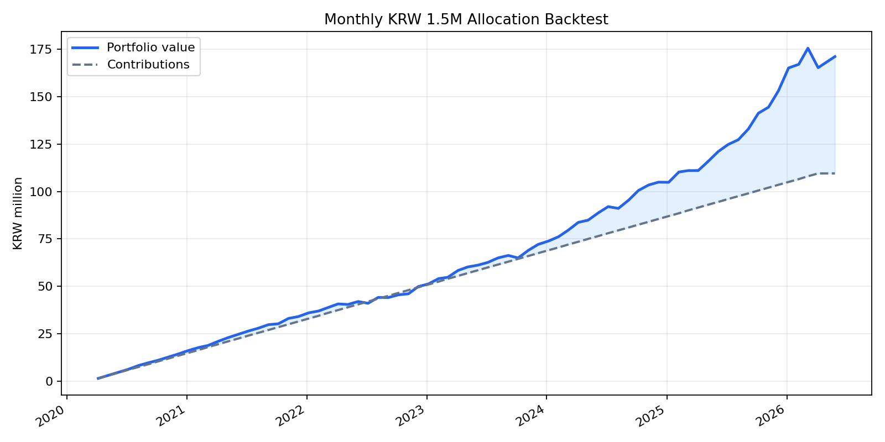

# 실제 국내 ETF 가격 기반 월별 150만원 백테스트

## 가정
- 매수 기간: 2020-04-06 ~ 2026-04-06, 매월 6일 리포트 배분표 기준
- 평가일: 2026-05-27
- 가격 데이터: Yahoo Finance 국내 ETF 조정종가
- 매수/평가는 해당일 또는 직전 거래일 조정종가 사용
- 세금, 수수료, 슬리피지, 실제 체결가 차이는 반영하지 않음

## ETF 매핑
| 리포트 자산군 | 실제 ETF |
|---|---|
| cash | KODEX 단기채권 `153130.KS` |
| gold | KODEX 골드선물(H) `132030.KS` |
| silver | KODEX 은선물(H) `144600.KS` |
| equity | KODEX 미국S&P500선물(H) `219480.KS` |

## 결과 요약
- 누적 투자원금: 1.09억원 (109,500,000원)
- 평가금액: 1.71억원 (171,035,371원)
- 평가손익: 0.62억원 (61,535,371원)
- 단순 수익률: 56.20%
- 연환산 자금가중수익률 XIRR: 14.26%
- 월별 평가 기준 최대 낙폭: -5.86%

## 자산별 기여
| 자산 | 누적 매수 | 평가금액 | 손익 | 수익률 | 평가 비중 |
|---|---:|---:|---:|---:|---:|
| KODEX 단기채권 `153130.KS` | 39,650,000원 | 42,941,511원 | 3,291,511원 | 8.30% | 25.11% |
| KODEX 골드선물(H) `132030.KS` | 26,650,000원 | 48,994,313원 | 22,344,313원 | 83.84% | 28.65% |
| KODEX 은선물(H) `144600.KS` | 12,400,000원 | 30,648,774원 | 18,248,774원 | 147.17% | 17.92% |
| KODEX 미국S&P500선물(H) `219480.KS` | 30,800,000원 | 48,450,773원 | 17,650,773원 | 57.31% | 28.33% |

## 포트폴리오 곡선

## 출력 파일
- 거래/로트: `data/processed/backtests/actual_kr_etf_2020-04_to_2026-04/actual_etf_trades.csv`
- 월별 평가곡선: `data/processed/backtests/actual_kr_etf_2020-04_to_2026-04/actual_etf_equity_curve.csv`
