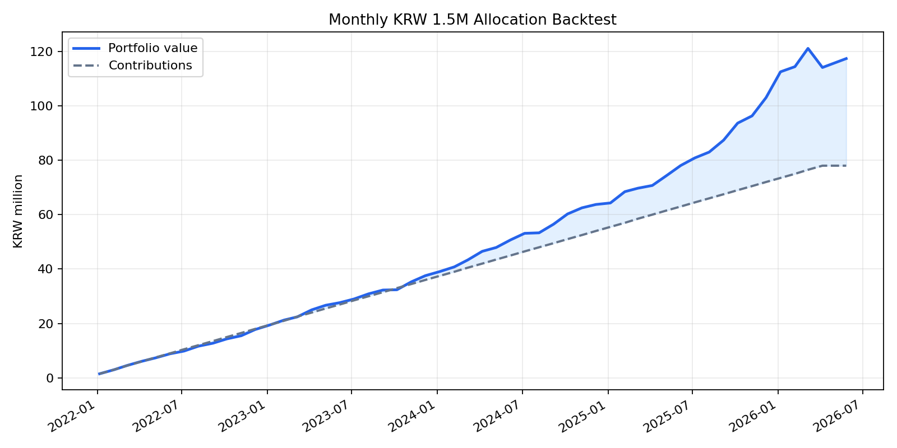

# 실제 국내 ETF 가격 기반 월별 150만원 백테스트

## 가정
- 매수 기간: 2022-01-06 ~ 2026-04-06, 매월 6일 리포트 배분표 기준
- 평가일: 2026-05-27
- 가격 데이터: Yahoo Finance 국내 ETF 조정종가
- 매수/평가는 해당일 또는 직전 거래일 조정종가 사용
- 세금, 수수료, 슬리피지, 실제 체결가 차이는 반영하지 않음

## ETF 매핑
| 리포트 자산군 | 실제 ETF |
|---|---|
| cash | KODEX 단기채권 `153130.KS` |
| gold | KODEX 골드선물(H) `132030.KS` |
| silver | KODEX 은선물(H) `144600.KS` |
| equity | KODEX 미국S&P500선물(H) `219480.KS` |

## 결과 요약
- 누적 투자원금: 0.78억원 (78,000,000원)
- 평가금액: 1.17억원 (117,372,017원)
- 평가손익: 0.39억원 (39,372,017원)
- 단순 수익률: 50.48%
- 연환산 자금가중수익률 XIRR: 18.58%
- 월별 평가 기준 최대 낙폭: -5.80%

## 자산별 기여
| 자산 | 누적 매수 | 평가금액 | 손익 | 수익률 | 평가 비중 |
|---|---:|---:|---:|---:|---:|
| KODEX 단기채권 `153130.KS` | 28,300,000원 | 30,150,764원 | 1,850,764원 | 6.54% | 25.69% |
| KODEX 골드선물(H) `132030.KS` | 20,550,000원 | 36,385,147원 | 15,835,147원 | 77.06% | 31.00% |
| KODEX 은선물(H) `144600.KS` | 9,650,000원 | 23,563,272원 | 13,913,272원 | 144.18% | 20.08% |
| KODEX 미국S&P500선물(H) `219480.KS` | 19,500,000원 | 27,272,834원 | 7,772,834원 | 39.86% | 23.24% |

## 포트폴리오 곡선

## 출력 파일
- 거래/로트: `data/processed/backtests/actual_kr_etf_variants/hedged_sp500_2022/actual_etf_trades.csv`
- 월별 평가곡선: `data/processed/backtests/actual_kr_etf_variants/hedged_sp500_2022/actual_etf_equity_curve.csv`
