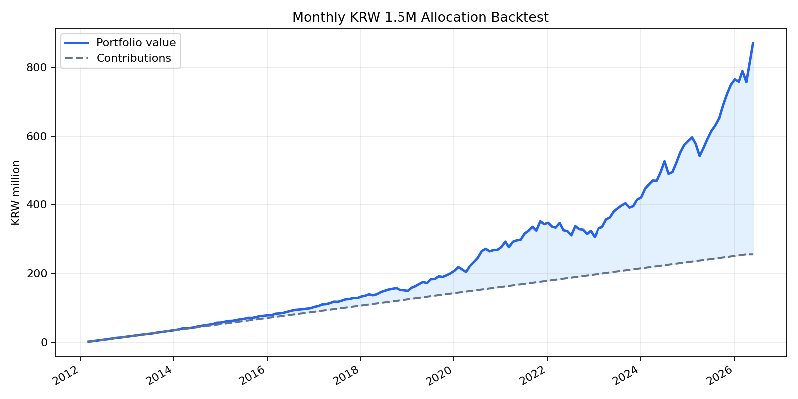

# 실제 국내 ETF 가격 기반 월별 150만원 백테스트

## 가정
- 매수 기간: 2012-03-06 ~ 2026-04-06, 매월 6일 리포트 배분표 기준
- 평가일: 2026-05-27
- 가격 데이터: Yahoo Finance 국내 ETF 조정종가
- 매수/평가는 해당일 또는 직전 거래일 조정종가 사용
- 세금, 수수료, 슬리피지, 실제 체결가 차이는 반영하지 않음

## ETF 매핑
| 리포트 자산군 | 실제 ETF |
|---|---|
| cash | KODEX 단기채권 `153130.KS` |
| gold | KODEX 골드선물(H) `132030.KS` |
| silver | KODEX 은선물(H) `144600.KS` |
| equity | TIGER 미국나스닥100 `133690.KS` |

## 결과 요약
- 누적 투자원금: 2.55억원 (255,000,000원)
- 평가금액: 8.69억원 (868,922,494원)
- 평가손익: 6.14억원 (613,922,494원)
- 단순 수익률: 240.75%
- 연환산 자금가중수익률 XIRR: 15.77%
- 월별 평가 기준 최대 낙폭: -13.16%

## 자산별 기여
| 자산 | 누적 매수 | 평가금액 | 손익 | 수익률 | 평가 비중 |
|---|---:|---:|---:|---:|---:|
| KODEX 단기채권 `153130.KS` | 92,550,000원 | 107,061,103원 | 14,511,103원 | 15.68% | 12.32% |
| KODEX 골드선물(H) `132030.KS` | 51,650,000원 | 112,913,084원 | 61,263,084원 | 118.61% | 12.99% |
| KODEX 은선물(H) `144600.KS` | 26,850,000원 | 72,276,757원 | 45,426,757원 | 169.19% | 8.32% |
| TIGER 미국나스닥100 `133690.KS` | 83,950,000원 | 576,671,550원 | 492,721,550원 | 586.92% | 66.37% |

## 포트폴리오 곡선

## 출력 파일
- 거래/로트: `data/processed/backtests/isa_etf_max/isa_max_unhedged_nasdaq100/actual_etf_trades.csv`
- 월별 평가곡선: `data/processed/backtests/isa_etf_max/isa_max_unhedged_nasdaq100/actual_etf_equity_curve.csv`
