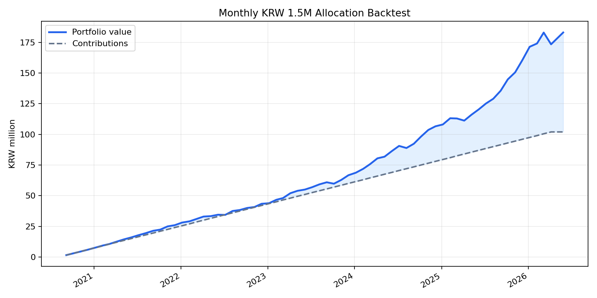

# 실제 국내 ETF 가격 기반 월별 150만원 백테스트

## 가정
- 매수 기간: 2020-09-06 ~ 2026-04-06, 매월 6일 리포트 배분표 기준
- 평가일: 2026-05-27
- 가격 데이터: Yahoo Finance 국내 ETF 조정종가
- 매수/평가는 해당일 또는 직전 거래일 조정종가 사용
- 세금, 수수료, 슬리피지, 실제 체결가 차이는 반영하지 않음

## ETF 매핑
| 리포트 자산군 | 실제 ETF |
|---|---|
| cash | KODEX 단기채권 `153130.KS` |
| gold | KODEX 골드선물(H) `132030.KS` |
| silver | KODEX 은선물(H) `144600.KS` |
| equity | TIGER 미국S&P500 `360750.KS` |

## 결과 요약
- 누적 투자원금: 1.02억원 (102,000,000원)
- 평가금액: 1.83억원 (183,128,641원)
- 평가손익: 0.81억원 (81,128,641원)
- 단순 수익률: 79.54%
- 연환산 자금가중수익률 XIRR: 20.23%
- 월별 평가 기준 최대 낙폭: -5.23%

## 자산별 기여
| 자산 | 누적 매수 | 평가금액 | 손익 | 수익률 | 평가 비중 |
|---|---:|---:|---:|---:|---:|
| KODEX 단기채권 `153130.KS` | 21,100,000원 | 22,756,403원 | 1,656,403원 | 7.85% | 12.43% |
| KODEX 골드선물(H) `132030.KS` | 26,600,000원 | 48,666,975원 | 22,066,975원 | 82.96% | 26.58% |
| KODEX 은선물(H) `144600.KS` | 12,200,000원 | 29,596,471원 | 17,396,471원 | 142.59% | 16.16% |
| TIGER 미국S&P500 `360750.KS` | 42,100,000원 | 82,108,791원 | 40,008,791원 | 95.03% | 44.84% |

## 포트폴리오 곡선

## 출력 파일
- 거래/로트: `data/processed/backtests/isa_etf_max/isa_max_unhedged_sp500/actual_etf_trades.csv`
- 월별 평가곡선: `data/processed/backtests/isa_etf_max/isa_max_unhedged_sp500/actual_etf_equity_curve.csv`
