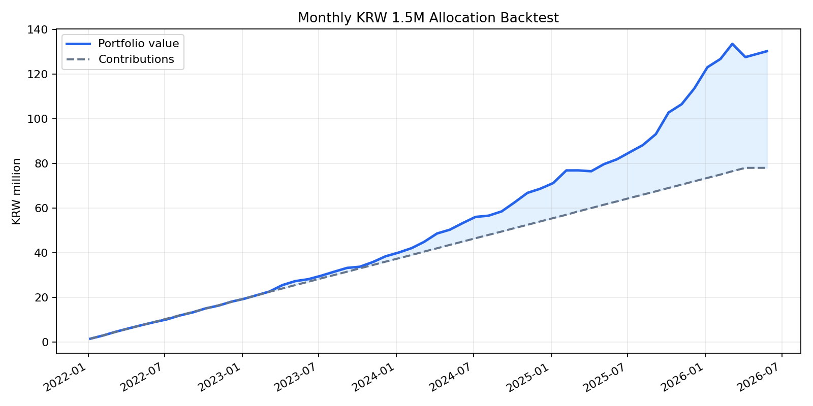

# 실제 국내 ETF 가격 기반 월별 150만원 백테스트

## 가정
- 매수 기간: 2022-01-06 ~ 2026-04-06, 매월 6일 리포트 배분표 기준
- 평가일: 2026-05-27
- 가격 데이터: Yahoo Finance 국내 ETF 조정종가
- 매수/평가는 해당일 또는 직전 거래일 조정종가 사용
- 세금, 수수료, 슬리피지, 실제 체결가 차이는 반영하지 않음

## ETF 매핑
| 리포트 자산군 | 실제 ETF |
|---|---|
| cash | KODEX 단기채권 `153130.KS` |
| gold | ACE KRX금현물 `411060.KS` |
| silver | KODEX 은선물(H) `144600.KS` |
| equity | TIGER 미국S&P500 `360750.KS` |

## 결과 요약
- 누적 투자원금: 0.78억원 (78,000,000원)
- 평가금액: 1.30억원 (130,231,073원)
- 평가손익: 0.52억원 (52,231,073원)
- 단순 수익률: 66.96%
- 연환산 자금가중수익률 XIRR: 23.50%
- 월별 평가 기준 최대 낙폭: -4.45%

## 자산별 기여
| 자산 | 누적 매수 | 평가금액 | 손익 | 수익률 | 평가 비중 |
|---|---:|---:|---:|---:|---:|
| KODEX 단기채권 `153130.KS` | 28,300,000원 | 30,150,764원 | 1,850,764원 | 6.54% | 23.15% |
| ACE KRX금현물 `411060.KS` | 20,550,000원 | 43,660,528원 | 23,110,528원 | 112.46% | 33.53% |
| KODEX 은선물(H) `144600.KS` | 9,650,000원 | 23,581,988원 | 13,931,988원 | 144.37% | 18.11% |
| TIGER 미국S&P500 `360750.KS` | 19,500,000원 | 32,837,793원 | 13,337,793원 | 68.40% | 25.22% |

## 포트폴리오 곡선

## 출력 파일
- 거래/로트: `data/processed/backtests/isa_etf_max/isa_unhedged_gold_sp500/actual_etf_trades.csv`
- 월별 평가곡선: `data/processed/backtests/isa_etf_max/isa_unhedged_gold_sp500/actual_etf_equity_curve.csv`
