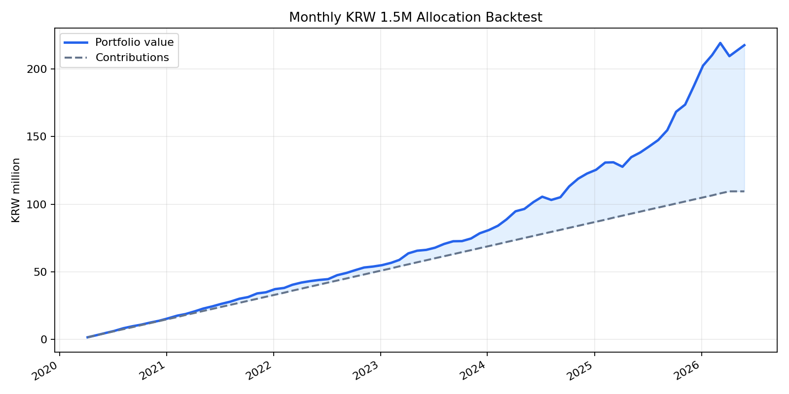

# 월별 150만원 매수 백테스트

## 가정
- 매수 기간: 2020-04-06 ~ 2026-04-06, 매월 6일 리포트 배분표 기준
- 평가일: 2026-05-27
- 금: Yahoo Finance `GC=F` 종가를 USD/KRW로 원화 환산
- 은/원자재: Yahoo Finance `SI=F` 종가를 USD/KRW로 원화 환산
- 주식/ETF: Yahoo Finance `SPY` 조정종가를 USD/KRW로 원화 환산
- 현금성/단기채: `korea_short_rate_3m` 연율을 일복리로 적용
- 세금, 수수료, 슬리피지, 실제 ETF 추적오차는 반영하지 않음

## 결과 요약
- 누적 투자원금: 1.09억원 (109,500,000원)
- 평가금액: 2.18억원 (217,652,391원)
- 평가손익: 1.08억원 (108,152,391원)
- 단순 수익률: 98.77%
- 연환산 자금가중수익률 XIRR: 22.07%
- 월별 평가 기준 최대 낙폭: -4.45%

## 자산별 기여
| 자산 | 누적 매수 | 평가금액 | 손익 | 수익률 | 평가 비중 |
|---|---:|---:|---:|---:|---:|
| 현금성/단기채 | 39,650,000원 | 43,453,693원 | 3,803,693원 | 9.59% | 19.96% |
| 금 | 26,650,000원 | 65,963,419원 | 39,313,419원 | 147.52% | 30.31% |
| 은/원자재 | 12,400,000원 | 42,645,449원 | 30,245,449원 | 243.91% | 19.59% |
| 주식/ETF | 30,800,000원 | 65,589,830원 | 34,789,830원 | 112.95% | 30.14% |

## 포트폴리오 곡선

## 출력 파일
- 거래/로트: `data/processed/backtests/monthly_allocation_2020-04_to_2026-04/monthly_allocation_trades.csv`
- 월별 평가곡선: `data/processed/backtests/monthly_allocation_2020-04_to_2026-04/monthly_allocation_equity_curve.csv`
