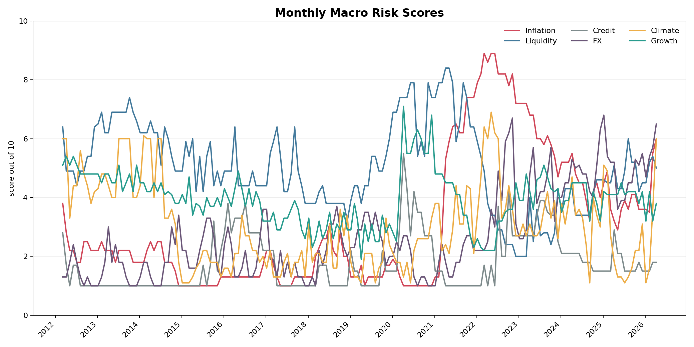
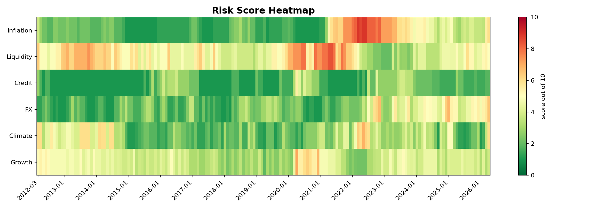
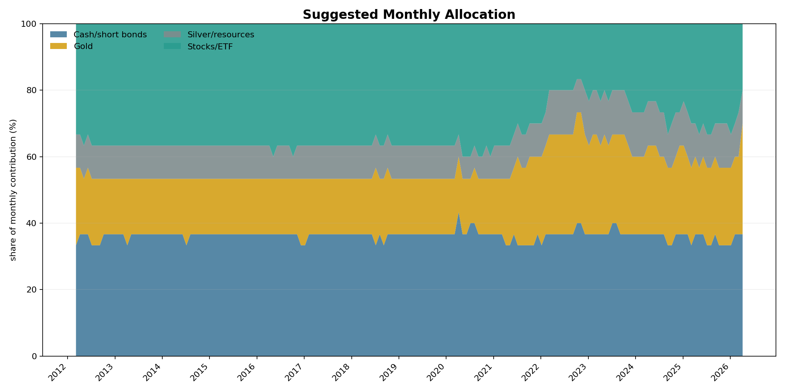
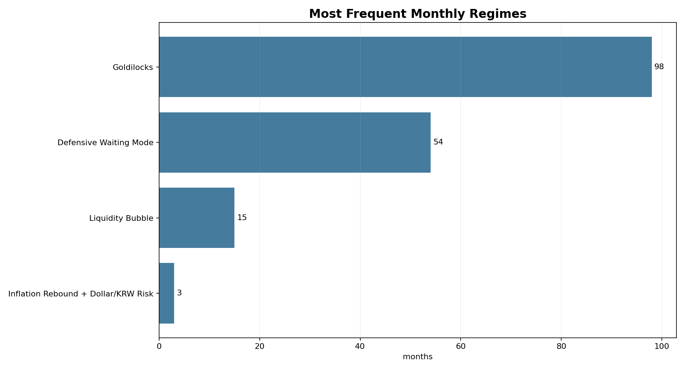
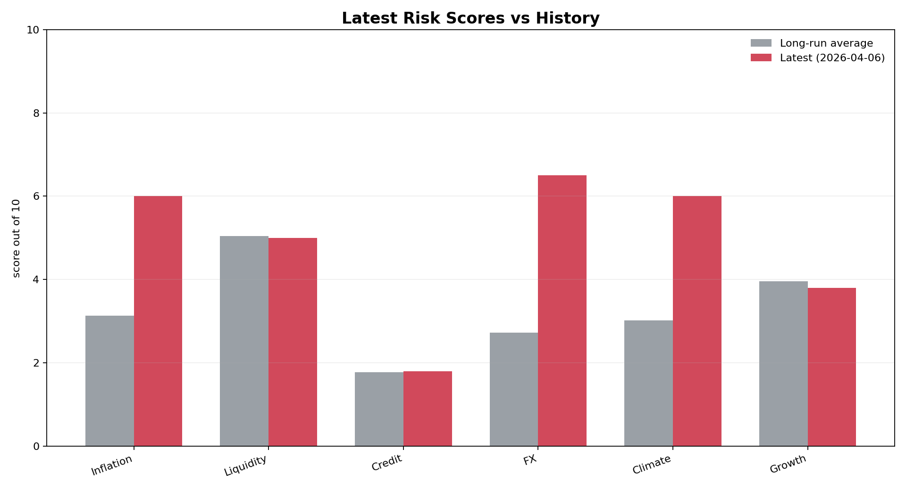

# 월별 매크로 히스토리 대시보드

기준 데이터: `data/processed/macro/risk_score_history_monthly.csv`
기간: 2012-03-06 ~ 2026-04-06 (170개월)

## 핵심 Risk Score 요약

| risk_bucket | latest | long_run_avg | min | max | change_12m |
| --- | --- | --- | --- | --- | --- |
| Inflation | 6.0 | 3.1 | 1.0 | 8.9 | +2.8 |
| Liquidity | 5.0 | 5.0 | 2.0 | 8.4 | -0.1 |
| Credit | 1.8 | 1.8 | 1.0 | 5.5 | -1.1 |
| FX | 6.5 | 2.7 | 1.0 | 6.8 | +1.3 |
| Climate | 6.0 | 3.0 | 1.1 | 6.9 | +4.2 |
| Growth | 3.8 | 4.0 | 1.9 | 7.1 | -0.3 |

## 최근 월 배분

최근 기준일: 2026-04-06

| asset | amount_manwon | share |
| --- | --- | --- |
| Cash/short bonds | 55 | 36.7% |
| Gold | 50 | 33.3% |
| Silver/resources | 15 | 10.0% |
| Stocks/ETF | 30 | 20.0% |

## 레짐 빈도

| regime | months | share |
| --- | --- | --- |
| Goldilocks | 98 | 57.6% |
| Defensive Waiting Mode | 54 | 31.8% |
| Liquidity Bubble | 15 | 8.8% |
| Inflation Rebound + Dollar/KRW Risk | 3 | 1.8% |

## 그래프

### Risk Score Trend

월별 6개 Risk Score의 장기 흐름입니다.

### Risk Score Heatmap

어느 구간에서 어떤 리스크가 강했는지 한눈에 보는 표입니다.

### Allocation Trend

월별 150만원 신규 투자금의 제안 배분 비중 변화입니다.

### Regime Counts

월별 리포트에서 가장 자주 나온 메인 레짐입니다.

### Latest vs Average

최근 점수가 장기 평균 대비 높은지 낮은지 비교합니다.

## 연도별 평균 Risk Score

| year | months | inflation | liquidity | credit | fx | climate | growth |
| --- | --- | --- | --- | --- | --- | --- | --- |
| 2012 | 10 | 2.4 | 5.2 | 1.4 | 1.4 | 4.7 | 5.0 |
| 2013 | 12 | 2.1 | 6.8 | 1.0 | 1.6 | 4.9 | 4.6 |
| 2014 | 12 | 2.0 | 5.9 | 1.0 | 1.8 | 4.5 | 4.2 |
| 2015 | 12 | 1.0 | 5.1 | 1.4 | 2.2 | 1.6 | 3.8 |
| 2016 | 12 | 1.3 | 4.7 | 3.0 | 2.0 | 2.1 | 4.0 |
| 2017 | 12 | 1.4 | 5.0 | 1.3 | 1.7 | 1.7 | 3.2 |
| 2018 | 12 | 2.2 | 3.8 | 1.2 | 2.2 | 2.4 | 2.9 |
| 2019 | 12 | 1.4 | 4.8 | 1.4 | 2.7 | 1.8 | 2.9 |
| 2020 | 12 | 1.2 | 7.0 | 3.2 | 1.8 | 2.1 | 5.3 |
| 2021 | 12 | 5.3 | 7.4 | 1.1 | 1.9 | 3.2 | 4.0 |
| 2022 | 12 | 8.3 | 3.5 | 2.1 | 3.9 | 4.8 | 2.9 |
| 2023 | 12 | 6.2 | 2.8 | 3.1 | 4.0 | 3.1 | 4.4 |
| 2024 | 12 | 4.6 | 3.9 | 1.9 | 4.8 | 3.3 | 4.0 |
| 2025 | 12 | 3.8 | 4.8 | 1.7 | 4.9 | 2.4 | 4.1 |
| 2026 | 4 | 4.7 | 5.0 | 1.6 | 5.6 | 3.1 | 3.6 |
